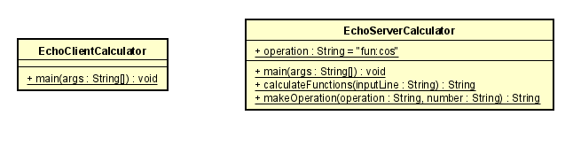
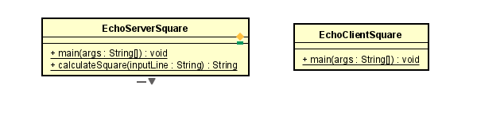
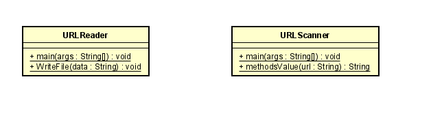
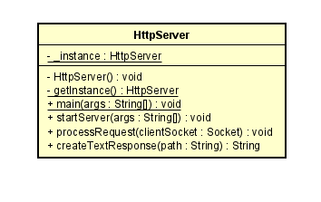
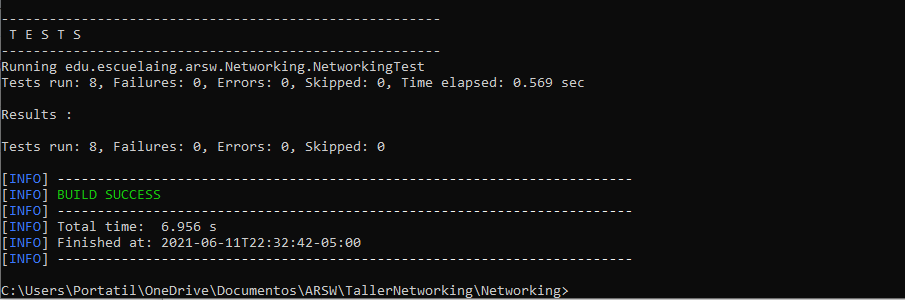

# Networking
### Daniel Santiago Ducuara Ardila
### 11/06/2021

## Diagrama de clases

### Paquete Calculator
 
En el paquete Calculator se divide en dos clases, el cliente y el servidor, en el método main de ambas clases se inicia el proceso
de conexión entre ambos, en el servidor el método calculateFunctions recibe como entrada el número que vaya ingresando la clase cliente,
la calculadora esta inicializada para empezar a calcular el coseno de un número, al enviar números está responderá con el coseno de cada número,
si se quiere cambiar de función es necesario ingresar "fun:sin" o "fun:tan" o "fun:con" para calcular el seno, tangente o coseno de un número respectivamente.
Para cerrar la conexión es necesario escribir "Bye.".El método makeOperations se realizó para facilitar el proceso de pruebas.
Para la ejecución es necesario iniciar primero el servidor y luego el cliente. la clase cliente empieza a enviar números y el servidor irá respondiendo.
### Paquete Square
 
En el paquete Square se divide en dos clases, el cliente y el servidor, en el método main de ambas clases se inicia el proceso
de conexión entre ambos, en el servidor el método calculateSquare recibe como entrada el número que vaya ingresando la clase cliente 
y el método le retorna el número que recibió al cuadrado. Para cerrar la conexión es necesario escribir "Bye.".
Para la ejecución es necesario iniciar primero el servidor y luego el cliente. la clase cliente empieza a enviar números y el servidor
irá respondiendo.
### Paquete URL
 
El URLReader en el método main recibe una url, el método guarda la información html de la página y envía esta información al método writeFile,
esté método se encarga de crear un archivo llamado resultado.html con la información guardada, este archivo se creará en la raiz de la carpeta.

El URLScanner recibe una url en el método main y la envía al método methodsValue que retorna la información de los 8 métodos que retornan lainformación del
objeto URL.
### Paquete HttpServer
 
El paquete HttpServer se encarga de crear un servidor que soporte múltiples solicitudes, la clase cuenta con métodos como startServer en el cual se inicia la conexión 
al servidor, en el método processRequest se crea la solicitud del servidor y en el método createTextResponse retorna la información del archivo html.
Para la ejecución es necesario iniciar el servidor y en el navegador colocar 127.0.0.1:35000/archivo, para la parte del archivo se encuentran 3 archivos en la 
carpeta TestHttpServer para probar con dichos archivos.

## Reporte de pruebas
 
Se realiza el reporte de pruebas con todas las pruebas satisfactorias.
Para las pruebas de HttpServer se encuentra la carpeta TestHttpServer con 3 archivos html.
Al ejecutar las pruebas se crea un archivo resultado.html en la raiz de la carpeta, si este archivo se crea quiere decir que la prueba de 
URLReader es satisfactoria. 

### Productividad
La productividad de este proyecto fue de 529LOC/15 horas .